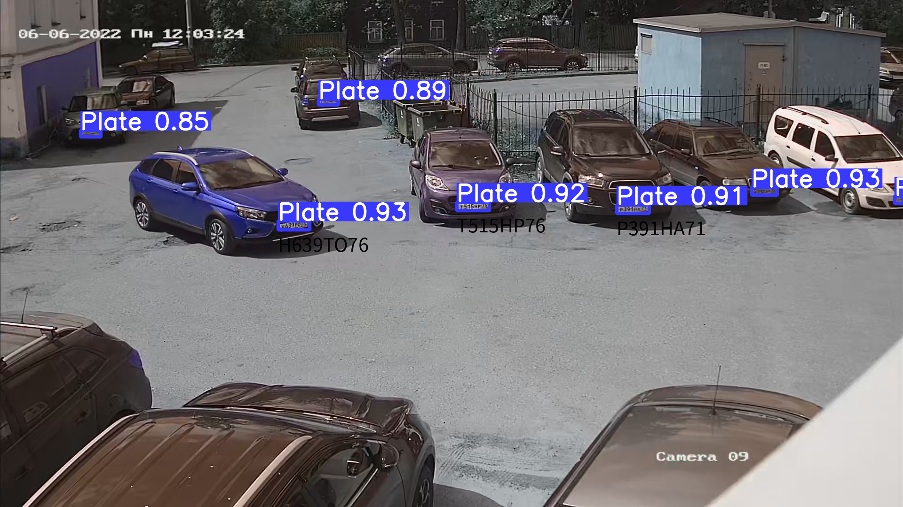
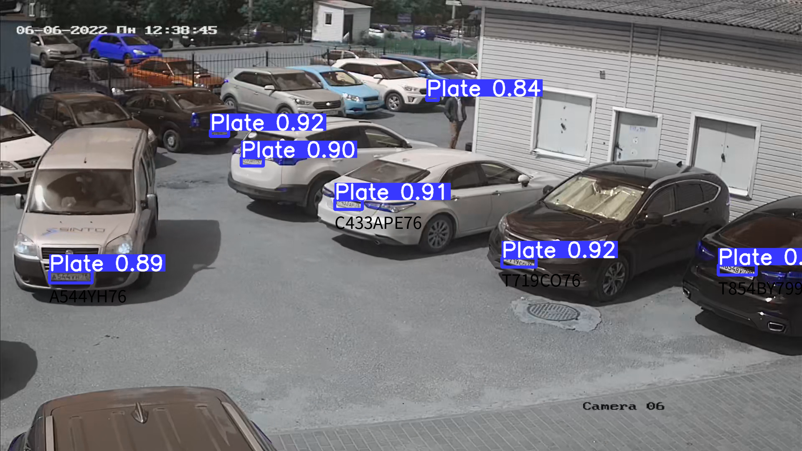
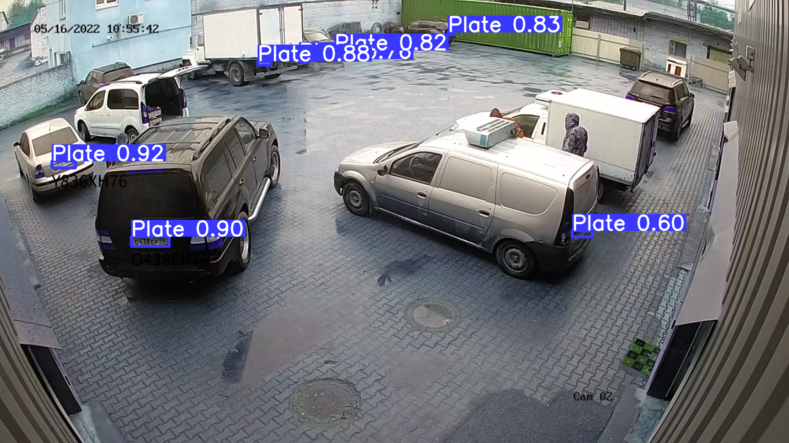

# License Plate Recognition
Detection and recognition of Russian license plates 
using [YoloV5](https://github.com/ultralytics/yolov5) 
and [License Plate Recognition Network](https://www.sciencedirect.com/science/article/abs/pii/S0167865518306998).
## Docker

```bash
$ docker pull etokone/license_plate_recognition:latest
$ docker run --gpus all --rm -it -p 8081:8080 etokone/license_plate_recognition:latest
```

## Prediction
```bash
$ curl -X POST -F file=@example_image.png http://0.0.0.0:8081/predict
```
```json
{
  "0":{"xmin":1598.5455322266,"ymin":399.8723449707,"xmax":1652.2009277344,"ymax":415.0353088379,
       "confidence":0.931964159,"class":0,"name":"Plate","Number":null},
  "1":{"xmin":591.9268798828,"ymin":470.7789306641,"xmax":658.0405883789,"ymax":489.2675476074,
       "confidence":0.9258311391,"class":0,"name":"Plate","Number":"H639TO76"},
  "2":{"xmin":971.9020996094,"ymin":430.119354248,"xmax":1040.9666748047,"ymax":448.1368408203,
       "confidence":0.921592474,"class":0,"name":"Plate","Number":"T515HP76"},
  "3":{"xmin":1311.4468994141,"ymin":436.5375671387,"xmax":1380.4725341797,"ymax":454.7528076172,
       "confidence":0.9069831967,"class":0,"name":"Plate","Number":"P391HA71"},
  "4":{"xmin":677.9398193359,"ymin":211.6175994873,"xmax":719.9579467773,"ymax":223.0309753418,
       "confidence":0.891178906,"class":0,"name":"Plate","Number":null},
  "5":{"xmin":171.3097686768,"ymin":277.8567504883,"xmax":214.3333282471,"ymax":291.2663879395,
       "confidence":0.8507843614,"class":0,"name":"Plate","Number":null},
  "6":{"xmin":1902.1220703125,"ymin":417.3900146484,"xmax":1920.0,"ymax":433.4660339355,
       "confidence":0.840703547,"class":0,"name":"Plate","Number":null}}
```

## Docs

- [Prepare dataset for yolo](./docs/prepare_yolo_dataset.md)
- [Prepare lpr dataset](./docs/prepare_lpr_dataset.md)
- [Train LPR Net and Spatial transformer](./docs/train_LPRNet.md)
- [Inference](./docs/full_pipeline.md)

## Visual examples





